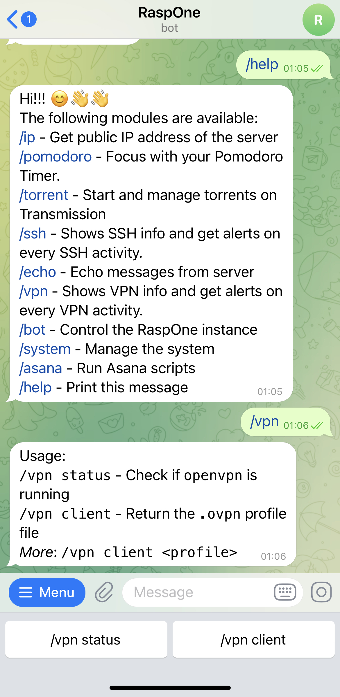
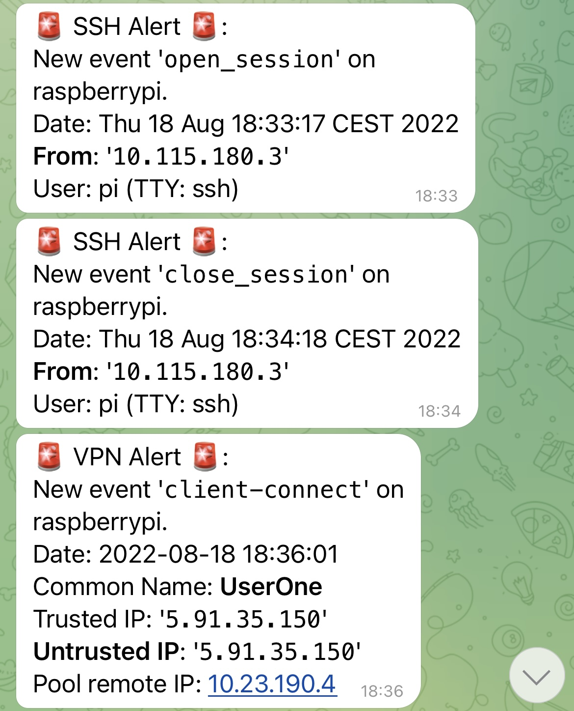
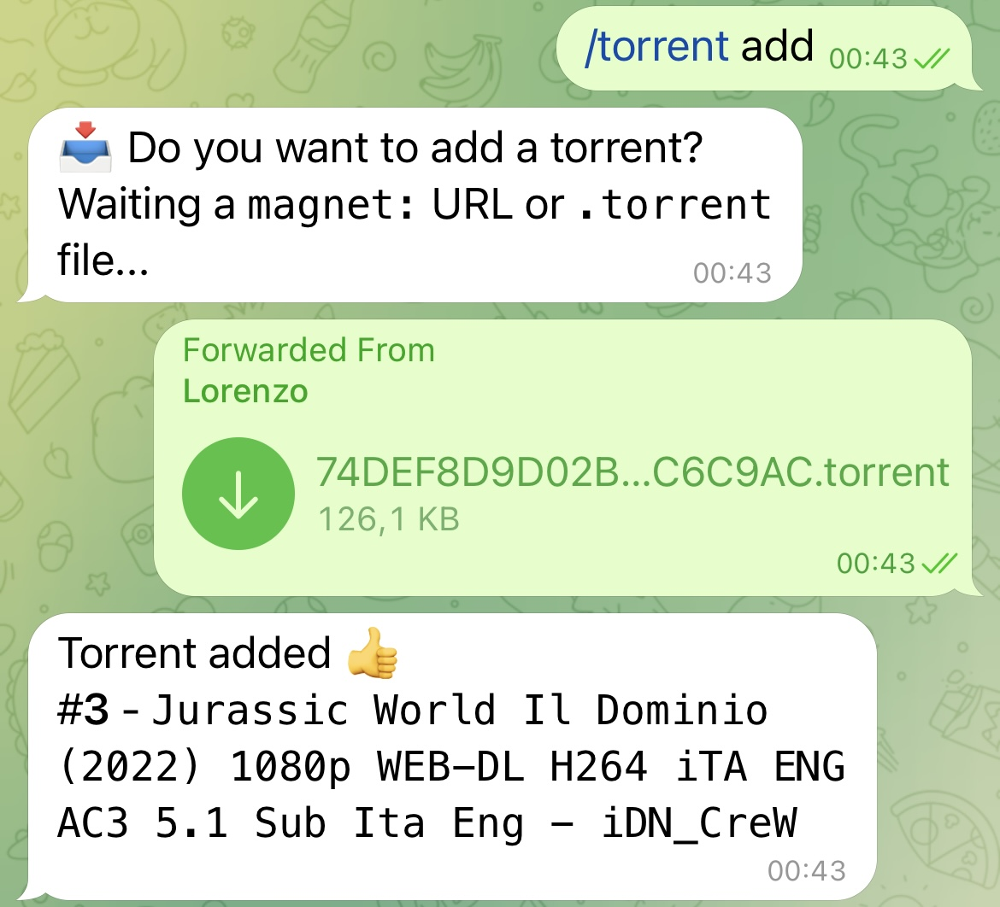
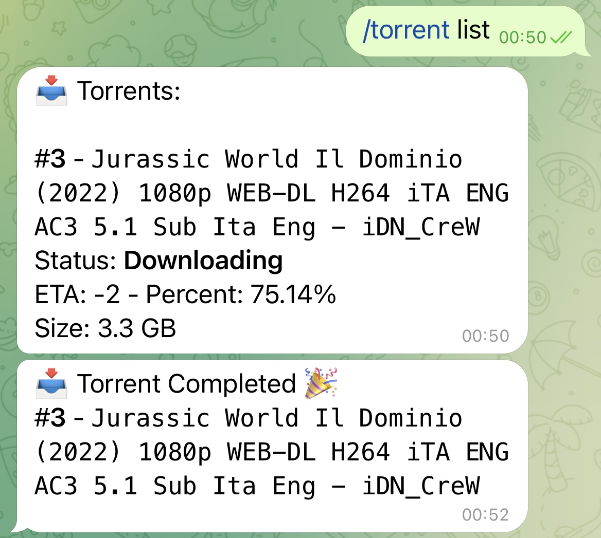

# RaspOne
Modular Telegram bot designed for being run on a Raspberry Pi as a swiss-army server.  
**RaspOne** provides a list of modules, described below, along with the ability to define and implement your own ones.  

Default modules are stored in the [`modules/`](modules/) directory.  
Personal modules and configuration can be stored in the `personal_modules/` directory.  

_Please, consider **RaspOne** as an english word and not an italian one... 😊_


## Usage
- Invoke **RaspOne**'s module commands from Telegram, with the help of contextualized keyboards:  
<p align="middle"></p>

- Receive alerts from your modules when an event occurs, like a new SSH connection:  
<p align="middle"> </p>

- Explore all default modules present in **RaspOne**:
<p align="middle">
  
   
</p>


## Current modules
- **Asana**: Run Asana scripts.
  - `/asana assign` (see this [gist](https://gist.github.com/lorenzodifuccia/a83b204e4c9020e0b38ba30257be6d84))
- **Bot**: Control the RaspOne instance.
  - `/bot resart` (restart the bot, loading new modules)
  - `/bot request <request id>` (get error info about a network request)
- **Echo**: Echo messages from server (an example for the Alert/IPC mechanism)
- **IP**: Get public IP address of the server.
  - `/ip get` 
  - `/ip get ipv6`
  - `/ip list` (Get list of previous logged IP addresses)
- **Pomodoro**: Focus with your Pomodoro Timer.
  - `/pomodoro start` (default 20 min)
  - `/pomodoro start 15` (every 15 min)
  - `/pomodoro start TIMER` (every 20 min with `TIMER` as message)
  - `/pomodoro start 15 TIMER`
  - `/pomodoro stop`
  - `/pomodoro status`
- **S3**: Save and manage objects on an AWS S3 bucket.
  - `/s3 status` (show if the command is available)
  - `/s3 list` (list objects on S3 bucket)
  - `/s3 save` (save file sent in the chat on S3 bucket)
  - `/s3 delete` (delete object from S3 bucket)
- **SSH**: Shows SSH info and get alerts on every SSH activity.
  - `/ssh status`
  - `/ssh port` (show running port)
  - `/ssh fingerprint` (return ECDSA and ED25519 keys fingerprints for verification)
- **System**: Manage the system.
  - `/system reboot` (reboot the server)
- **Torrent**: Start and manage torrents on Transmission.
  - `/torrent status`
  - `/torrent list` (list torrents)
  - `/torrent add` (add a torrent from a `magnet:` URL or a `.torrent` file sent in the chat)
  - `/torrent remove` (remove a torrent, keeping local data if completed)
  - `/torrent pause` (pause or resume a torrent)
- **VPN**: Shows VPN info and get alerts on every VPN activity.
  - `/vpn status`
  - `/vpn client` (return `.ovpn` profile file, default `UserOne.ovpn`)
  - `/vpn client <profile>`


## Installation
```bash
cd /home/pi/Documents/
git clone https://www.github.com/lorenzodifuccia/RaspOne

cd RaspOne
virtualenv venv  # pip3 install virtualenv
source venv/bin/activate
pip3 install -r requirements.txt

# Optional
mkdir personal_modules
cp rasp_conf.ini personal_modules/
cd personal_modules/

# IMPORTANT: modify the configuration file, add BotToken, ChatId of the user, etc.
nano rasp_conf.ini

sudo ln -s /home/pi/Documents/RaspOne/rasp-one.service /etc/systemd/system/
sudo systemctl daemon-reload
sudo systemctl start rasp-one.service
sudo systemctl enable rasp-one.service

echo "enjoy :)"
```

### Configuration
Some modules provided by **RaspOne** use some scripts executed by services like `sshd` or `openvpn` to receive alerts on a so-called "IPC" server listener.
Other modules requires permissions to be granted.  
Every module that require a different configuration, drops a script in the `utils/` directory, created after **RaspOne** is started.  

List of modules that require a configuration on [`rasp_conf.ini`](rasp_conf.ini) or in `utils/`:
- **Asana**: add token on `rasp_conf.ini`.
- **Bot**: see `utils/rasp_cron_check.sh`.
- **S3**: see `rasp_conf.ini` and `modules/s3.py`.
- **SSH**: see `utils/rasp_ssh_alert.sh`.
- **System**: see `utils/rasp_one_system.conf`.
- **Torrent**: modify download directory on `rasp_conf.ini`, specify also the RPC URL if different from the default one.
- **VPN**: see `utils/rasp_vpn_alert.sh`, modify profiles directory path on `rasp_conf.ini` (see [`pivpn`](https://www.pivpn.io/)).


## Write you own module
```python
from modules import RaspOneBaseModule

class ModuleExample(RaspOneBaseModule):
    NAME = "example"
    DESCRIPTION = "Is this an example?"

    USAGE = {
        "yes": "Yeeeeeeeeeeeeeeeeeeeess"
    }

    def __init__(self, core):
        super().__init__(core)

    async def command(self, update, context):
        if context.args[0] == "yes":
            await update.effective_message.reply_text("No 😒")
```

For Alert, Updater and MessageHandler see respectively [`ssh`](modules/ssh.py), [`pomodoro`](modules/pomodoro.py) and [`torrent`](modules/torrent.py) modules.

## TODO
- [X] Update to `python-telegram-bot v20.0`
- [ ] Test new code for `python-telegram-bot v20.0`
- [ ] Add wiki for `/s3` module
- [ ] Handle systemctl stop signal
- [ ] Logging, everything...
- [ ] ASCII decode issue: log UTF-8
- [ ] Write decent README and wiki.

Made with <3 from Lorenzo Di Fuccia
